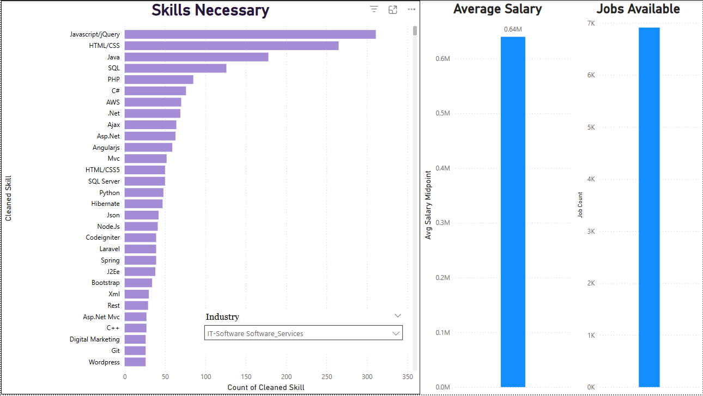
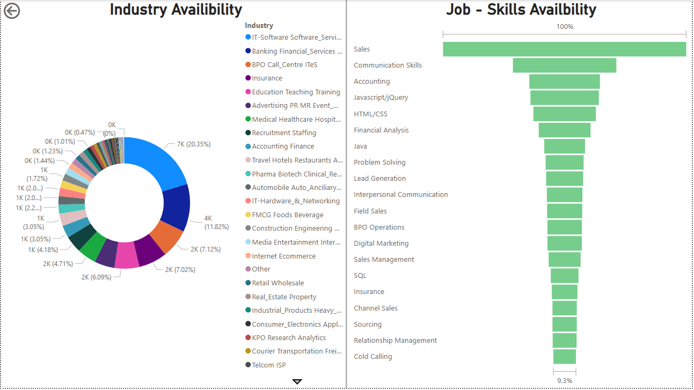
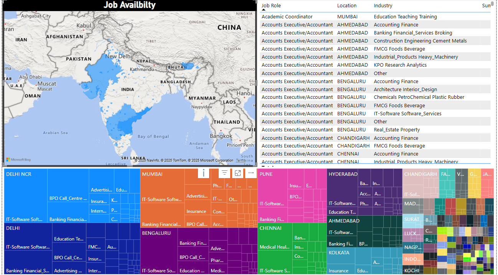

# 💼 Job Market Analytics Dashboard (India) - Power BI Data Analysis Project

 
This project analyzes entry-level job trends in the Indian job market using data from [Naukri.com via Kaggle](https://www.kaggle.com/datasets/promptcloud/jobs-on-naukricom).
  
The goal is to **identify the most in-demand technical and soft skills**, explore **salary trends**, and help students and professionals align their learning with market needs.

  


## 🎯 Project Objectives

* 📌 Identify **top in-demand skills** across IT, Sales, and other entry-level roles

* 📈 Analyze **salary trends by experience and location**

* 🗺️ Visualize **job availability** by role, city, and industry

* 📊 Provide **interactive Power BI reports** for easy exploration

  
  
  

## 🛠️ Tools & Technologies Used

  

*  **Power BI** – Visualization & dashboarding

*  **Excel** – Pre-processing and cleaning

*  **Power Query & DAX** – Data transformation and calculations

  
  

## 📷 Dashboard Snapshots








  
  

---

  

## 📁 Folder Structure

  

```

📂 Job-Market-Analytics-Dashboard

│

├── 📁 assets/ 

│ ├── Report-1[Top_KPIs].png

│ ├── Report-2[Skills_Analysis].png

│ ├── Report-3[Salary&Experience_Trends].png

│ └── Report-4[Opportunity_Map].png

│

├── 📁 data/ 

│ └── cleaned_job_market_data.csv

│

├── 📁 docs/ 

│ └── JobMarket_Blackbook.pdf

│

├── 📁 pbix/ 

│ └── Job_Analysis.pbix

│

└── README.md

```

  
  

## 📌 How to Use This Project

  

1. Clone/download this repo.

2. Open `Job_Analysis.pbix` in Power BI Desktop.

3. Make sure the data paths are correct if loading local CSVs.

4. Explore the reports: Skills Analysis, Salary Trends, Job Mapping.

  
  
  

## 💡 Key Insights

  

*  `JavaScript`, `HTML/CSS`, and `SQL` are among the top IT skills.

* Most jobs are concentrated in cities like **Bengaluru**, **Mumbai**, and **Pune**.

* Salary increases with experience, especially in technical roles.
